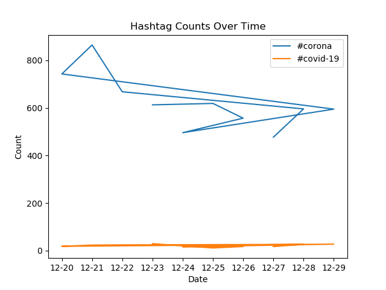

# Coronavirus Twitter Analysis

## Overview
This project aims to analyze geotagged tweets sent in 2020 to monitor the spread of coronavirus-related discussions on social media. The analysis involves processing a large-scale dataset using the MapReduce paradigm, working with multilingual text, and visualizing the results.

## Learning Objectives
1. Work with large-scale datasets.
2. Process multilingual text data.
3. Utilize the MapReduce paradigm for parallel processing.

## Tasks Completed

### Task 0: Mapper Enhancement
`map.py` script to track hashtag usage on both language and country levels. Added functionality to handle edge cases such as tweets without country information.

### Task 1: Running the Mapper
Created a shell script `run_maps.sh` to execute the `map.py` script on each file in the dataset. Utilized `nohup` and `&` for parallel execution.

### Task 2: Reducing Outputs
`reduce.py` script to merge outputs from the mapper into a single file for both language and country levels.

### Task 3: Visualizing Results
`visualize.py` script to generate bar graphs of hashtag usage, sorted from low to high, and saved them as PNG files. Visualized data for both language and country levels.

### Task 4: Alternative Reduction
Developed `alternative_reduce.py` to create a line plot showing daily tweet counts for specified hashtags throughout the year.

### Task 5: Uploading to GitHub
Committed all code and output files to a GitHub repository. Updated the `README.md` file with a project overview and inserted brief explanations along with the five generated PNG files.

## Visualizations

1. `#coronavirus.country.png`: Bar graph displaying the top 10 languages of tweets including this hashtag by language.
   
   

2. `#coronavirus.lang.png`: Bar graph displaying the top 10 countries of tweets including this hashtag by language.
   
   
   
3. `#코로나바이러스.country.lang`: Bar graph displaying the top 10 languages of tweets including this hashtag by language.
   
   
   
4. `#코로나바이러스.lang.png`: Bar graph displaying the top 10 countries of tweets including this hashtag by language.

   

5. `hashtag_counts.png`: Line plot of the frequency of a variety of hashtags and the dates of the frequency, all of 2020; therefore, the labels of the dates are illegible.

   

   
   
## Conclusion
This project demonstrates proficiency in handling large-scale datasets, multilingual text processing, and parallel computing using MapReduce. The visualizations provide insights into the distribution of coronavirus-related discussions across languages and countries on Twitter in 2020.
